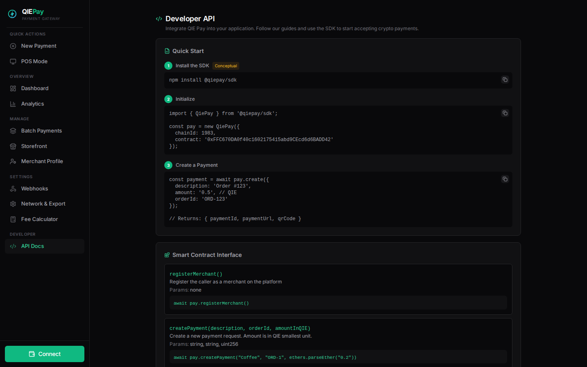
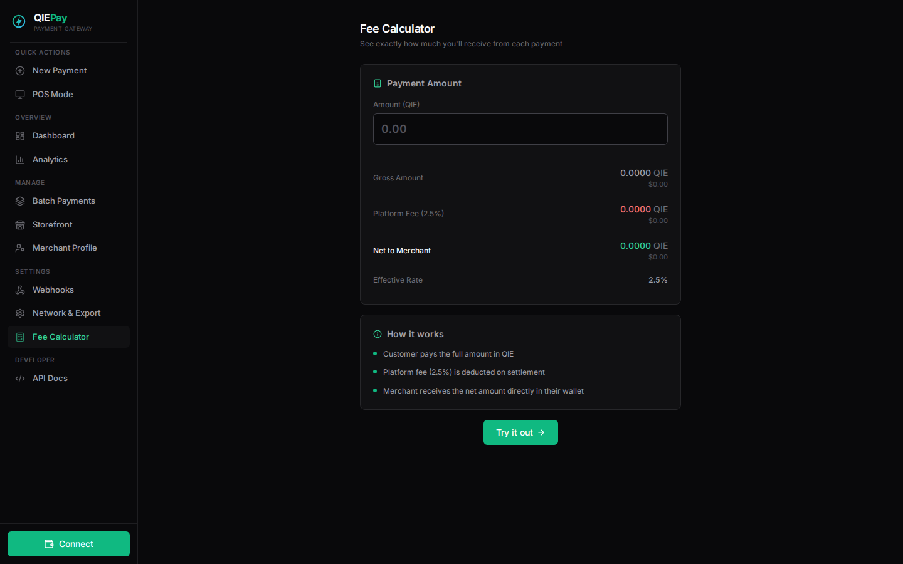

# QIE Pay — Decentralized Payment Gateway

A full-stack crypto payment gateway built on the **QIE Blockchain**. Accept QIE payments with low fees, instant settlement, and smart escrow — all on-chain.

> 🏆 Built for the **QIE Blockchain Hackathon 2026** — DeFi & Payments Track

---

## ✨ Features

| Feature | Description |
|---------|-------------|
| **Dashboard** | Real-time revenue charts, payment tracking, notifications |
| **Create Payment** | Generate payment links with QR codes |
| **Batch Payments** | Create multiple payments at once |
| **POS Mode** | Tablet-friendly Point of Sale for retail |
| **Storefront** | Public merchant page with product listings |
| **Analytics** | Revenue charts, daily/weekly/monthly trends |
| **Invoice Generator** | Downloadable HTML invoices per payment |
| **Webhooks** | Real-time payment event notifications |
| **API Docs** | Developer documentation with code snippets |
| **Fee Calculator** | Instant fee calculation with USD conversion |
| **CSV Export** | Export all transactions to CSV |
| **QR Codes** | Auto-generated QR for every payment link |

## 🖼️ Screenshots

**Landing Page**


**POS Mode**


**Developer API**


**Fee Calculator**


## 🛠️ Tech Stack

- **Frontend:** React 18, Vite, Tailwind CSS 3
- **Blockchain:** ethers.js v6, QIE Testnet (Chain ID 1983)
- **Smart Contract:** Solidity ^0.8.20, Hardhat
- **UI:** Framer Motion, Recharts, Lucide React, React Hot Toast
- **Design:** True gray color system, Stripe/Vercel-inspired dark mode

## 📦 Smart Contract

- **Network:** QIE Testnet (Chain ID 1983)
- **Contract:** [`0xFFC670DA0f40c1602175415abd9CEcd6d6BADD42`](https://explorer.qie.io/address/0xFFC670DA0f40c1602175415abd9CEcd6d6BADD42)
- **Fee:** 2.5% platform fee on settlement
- **Statuses:** Created → Paid → Settled / Refunded / Cancelled

### Contract Functions

```solidity
registerMerchant()                          // Register as merchant
createPayment(description, orderId, amount) // Create payment request
pay(paymentId)                              // Pay for a payment (payable)
settlePayment(paymentId)                    // Settle paid payment
refundPayment(paymentId)                    // Refund payment
cancelPayment(paymentId)                    // Cancel payment
```

## 🚀 Getting Started

### Prerequisites

- Node.js 18+
- QIE Wallet or MetaMask (configured for QIE Testnet)

### Installation

```bash
# Clone the repository
git clone https://github.com/ulsreall/qie-pay.git
cd qie-pay

# Install frontend dependencies
cd frontend
npm install

# Start development server
npm run dev
```

### Network Configuration

- **Chain ID:** 1983
- **RPC URL:** `https://rpc.qie.io`
- **Explorer:** `https://explorer.qie.io`
- **Currency:** QIE

## 📁 Project Structure

```
qie-pay/
├── contracts/
│   └── QIEPay.sol          # Smart contract
├── frontend/
│   ├── public/              # Static assets (logos, favicons)
│   ├── src/
│   │   ├── components/      # Reusable UI components
│   │   ├── pages/           # Page components (16 routes)
│   │   ├── utils/           # Contract, currency, invoice, export utils
│   │   ├── App.jsx          # Router + lazy loading
│   │   └── index.css        # Design system
│   ├── tailwind.config.js
│   └── vite.config.js       # Code splitting config
└── hardhat.config.js        # Contract deployment config
```

## 📊 Architecture

```
┌─────────────┐     ┌──────────────┐     ┌─────────────────┐
│   Customer   │────▶│  Payment Page │────▶│  Smart Contract  │
│  (Browser)   │     │  /pay/:id     │     │  (QIE Testnet)   │
└─────────────┘     └──────────────┘     └─────────────────┘
                           │                       │
                    ┌──────┴──────┐         ┌──────┴──────┐
                    │  QR Code    │         │  Escrow     │
                    │  Share Link │         │  Settlement │
                    └─────────────┘         └─────────────┘

┌─────────────┐     ┌──────────────┐     ┌─────────────────┐
│   Merchant   │────▶│  Dashboard   │────▶│  Notifications   │
│  (Browser)   │     │  Analytics   │     │  Webhooks        │
└─────────────┘     └──────────────┘     └─────────────────┘
```

## 🔗 Links

- **Live Demo:** [qie-pay.vercel.app](https://qie-pay.vercel.app/)
- **Contract:** [explorer.qie.io](https://explorer.qie.io/address/0xFFC670DA0f40c1602175415abd9CEcd6d6BADD42)
- **GitHub:** [ulsreall/qie-pay](https://github.com/ulsreall/qie-pay)

## 📄 License

MIT License — Built for QIE Blockchain Hackathon 2026
