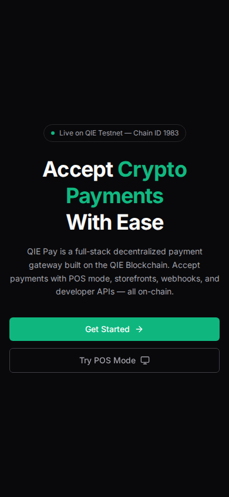

<div align="center">

# QIEPay

### Full-Stack Decentralized Payment Gateway on QIE Blockchain

A complete crypto payment solution with merchant dashboard, POS mode, storefronts, staking, governance, and developer APIs — all running 100% on-chain.

[](https://qie-pay.vercel.app)
[](https://testnet.qie.digital)
[](https://testnet.qie.digital)

**QIE Hackathon 2026 Submission**

</div>

---

## Screenshots

<div align="center">

| Home | Dashboard | Payment |
|:----:|:---------:|:-------:|
|  |  |  |

| POS Mode | Staking | Governance |
|:--------:|:-------:|:----------:|
|  |  |  |

| Faucet | API Docs | Mobile |
|:------:|:--------:|:------:|
|  |  |  |

</div>

---

## Features

### Core Payments
- **Create Payment** — Generate payment links and QR codes instantly
- **POS Mode** — Accept crypto payments in-store with fast checkout
- **Storefront** — Online store powered by crypto, list products on-chain
- **Batch Payments** — Process multiple payments at once (payroll, airdrops)

### Merchant Tools
- **Dashboard** — Real-time analytics, revenue tracking, transaction history
- **Analytics** — Deep insights into revenue, customer behavior, trends
- **Fee Calculator** — Transparent fee structure, calculate costs before processing
- **Merchant Settings** — Configure accepted tokens, fees, and branding

### DeFi Features
- **Staking** — Stake QIE tokens, earn up to 18.5% APY
- **Rewards** — Loyalty points on every transaction, redeem for perks
- **Governance** — Decentralized voting on protocol changes

### Developer Experience
- **REST APIs** — Full documentation with code examples
- **Webhooks** — Real-time event notifications
- **Testnet Faucet** — Free testnet tokens for development

---

## Tech Stack

<div align="center">

| Layer | Technology |
|-------|------------|
| Blockchain | QIE Blockchain (Solidity 0.8.20) |
| Frontend | React + Vite + Tailwind CSS |
| Web3 | Ethers.js + Wagmi |
| Smart Contracts | Hardhat + OpenZeppelin |
| Deployment | Vercel (Frontend) |

</div>

---

## Smart Contracts

All contracts are deployed on **QIE Testnet (Chain ID 1983)**.

| Contract | Address |
|----------|---------|
| QIEPay (Payment Gateway) | [`0xFFC670DA0f40c1602175415abd9CEcd6d6BADD42`](https://testnet.qie.digital/address/0xFFC670DA0f40c1602175415abd9CEcd6d6BADD42) |
| QIEStaking | [`0x98D953BE697C730Ebc94e5d5032f68503f7140fC`](https://testnet.qie.digital/address/0x98D953BE697C730Ebc94e5d5032f68503f7140fC) |
| QIEGovernance | [`0xDBdDb269CcBd0EcE141c14E9eCaF695f2b1f4d74`](https://testnet.qie.digital/address/0xDBdDb269CcBd0EcE141c14E9eCaF695f2b1f4d74) |
| QIERewards | [`0x56A140D3700aad23461605a3Cf7b9E880DfaECa4`](https://testnet.qie.digital/address/0x56A140D3700aad23461605a3Cf7b9E880DfaECa4) |
| QIEFaucet | [`0xe0BC1D6C...95E1E2a6`](https://testnet.qie.digital) |

---

## Getting Started

### Prerequisites
- Node.js 18+
- MetaMask or any Web3 wallet
- QIE Testnet tokens (get from [Faucet](https://qie-pay.vercel.app/faucet))

### Installation

```bash
# Clone repository
git clone https://github.com/ulsreall/qie-pay.git
cd qie-pay

# Install dependencies
npm install

# Install frontend dependencies
cd frontend && npm install

# Start development server
npm run dev
```

### Connect to QIE Testnet

| Parameter | Value |
|-----------|-------|
| Network Name | QIE Testnet |
| RPC URL | `https://rpc1testnet.qie.digital/` |
| Chain ID | 1983 |
| Currency Symbol | QIE |
| Explorer | `https://testnet.qie.digital` |

---

## Project Structure

```
qie-pay/
├── contracts/           # Solidity smart contracts
│   ├── QIEPay.sol       # Payment gateway
│   ├── QIEStaking.sol   # Staking rewards
│   ├── QIEGovernance.sol # Governance voting
│   ├── QIERewards.sol   # Loyalty rewards
│   └── QIEFaucet.sol    # Testnet faucet
├── frontend/
│   └── src/
│       ├── pages/       # React pages (16 pages)
│       ├── components/  # Reusable components
│       ├── utils/       # Constants, helpers
│       └── context/     # React context
├── scripts/             # Deployment scripts
├── test/                # Contract tests
└── hardhat.config.js    # Hardhat configuration
```

---

## Pages

| Page | Route | Description |
|------|-------|-------------|
| Home | `/` | Landing page with features overview |
| Dashboard | `/dashboard` | Merchant dashboard with analytics |
| Create Payment | `/create` | Generate payment links/QR codes |
| POS Mode | `/pos` | Point of sale for in-store payments |
| Storefront | `/store/:address` | Merchant product catalog |
| Analytics | `/analytics` | Revenue and transaction insights |
| Staking | `/staking` | Stake QIE tokens for rewards |
| Rewards | `/rewards` | Loyalty points and redemption |
| Governance | `/governance` | Vote on protocol proposals |
| Fee Calculator | `/fees` | Calculate transaction fees |
| Batch Payments | `/batch` | Process multiple payments |
| Faucet | `/faucet` | Get free testnet tokens |
| Developers | `/developers` | API documentation |
| Webhooks | `/webhooks` | Event notification setup |
| Settings | `/settings` | Account and wallet settings |
| Invoice | `/invoice/:id` | Payment invoice view |

---

## Architecture

```
┌─────────────────────────────────────────────────────────────┐
│                      QIEPay Architecture                     │
├─────────────────────────────────────────────────────────────┤
│                                                             │
│  ┌─────────────┐     ┌─────────────┐     ┌─────────────┐  │
│  │   Frontend   │────▶│   Ethers.js │────▶│   QIE Node  │  │
│  │   React/Vite │     │    Wagmi    │     │   (RPC)     │  │
│  └─────────────┘     └─────────────┘     └─────────────┘  │
│         │                                       │          │
│         ▼                                       ▼          │
│  ┌─────────────┐                        ┌─────────────┐    │
│  │   Vercel    │                        │  Smart      │    │
│  │   Deploy    │                        │  Contracts  │    │
│  └─────────────┘                        │  (Solidity) │    │
│                                         └─────────────┘    │
│                                                │            │
│                                                ▼            │
│                                         ┌─────────────┐    │
│                                         │  QIE Chain  │    │
│                                         │  ID: 1983   │    │
│                                         └─────────────┘    │
│                                                             │
└─────────────────────────────────────────────────────────────┘
```

---

## Contributing

1. Fork the repository
2. Create your feature branch (`git checkout -b feature/amazing-feature`)
3. Commit your changes (`git commit -m 'Add amazing feature'`)
4. Push to the branch (`git push origin feature/amazing-feature`)
5. Open a Pull Request

---

## License

This project is licensed under the MIT License - see the [LICENSE](LICENSE) file for details.

---

<div align="center">

### Links

[](https://qie-pay.vercel.app)
[](https://testnet.qie.digital)
[](https://github.com/ulsreall/qie-pay)

**Built for QIE Hackathon 2026**

</div>
