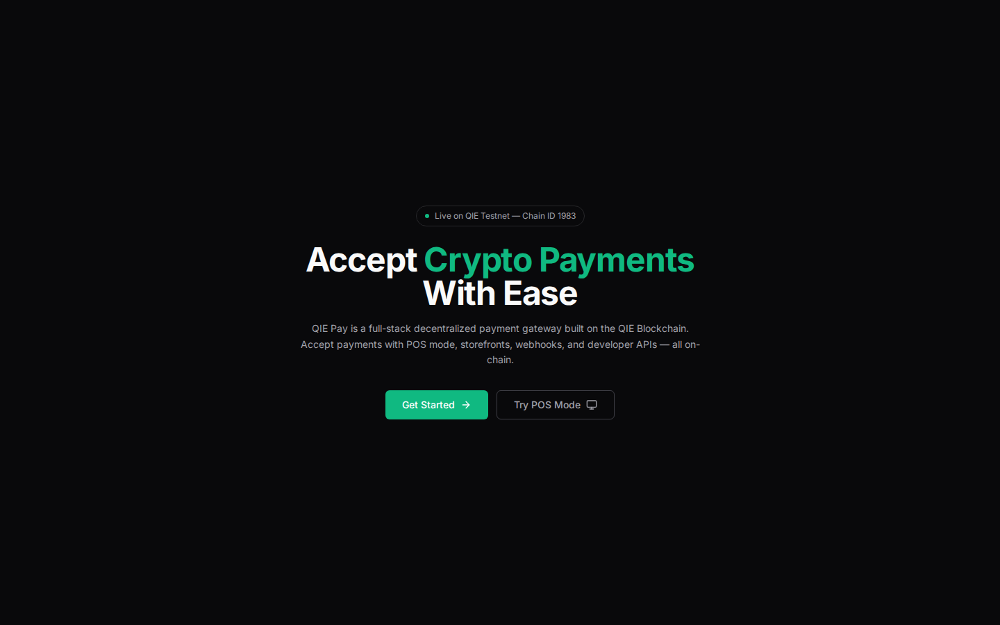
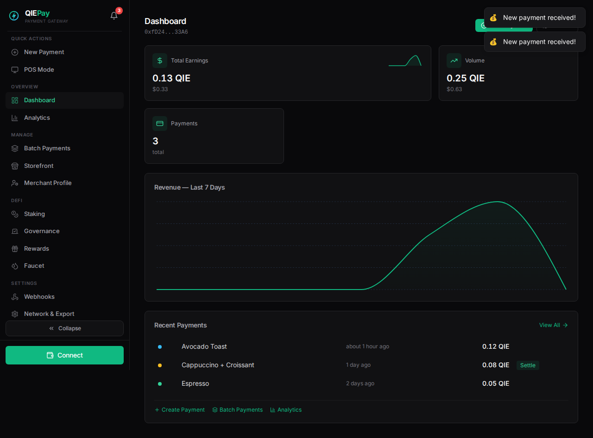
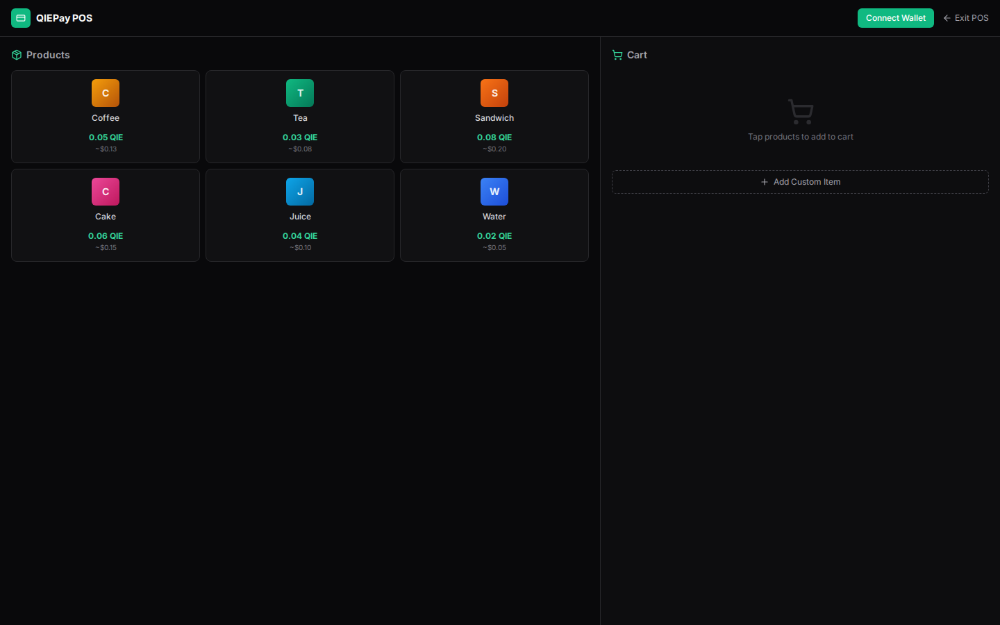
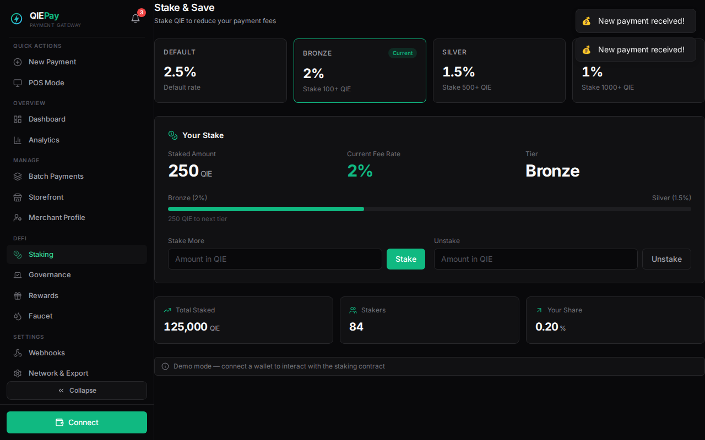
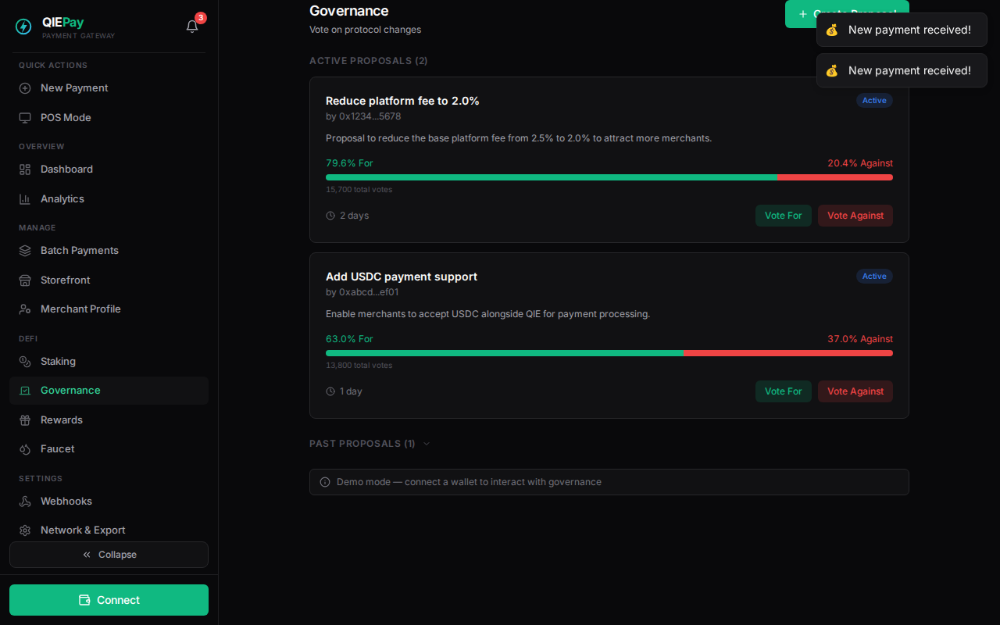
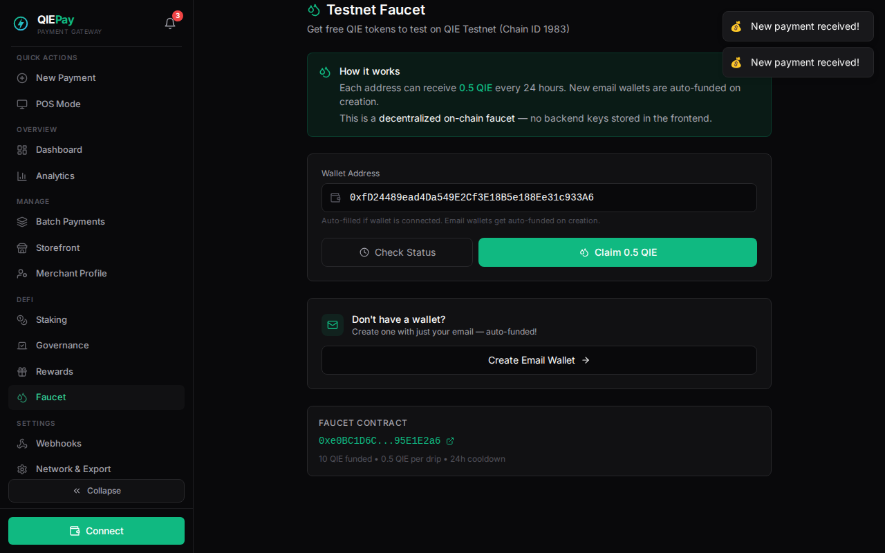

# QIE Pay — Decentralized Payment Gateway + DeFi Protocol

A full-stack crypto payment gateway and DeFi protocol built on **QIE Blockchain**. Accept QIE payments with low fees, instant settlement, smart escrow, and earn rewards — all on-chain.

> 🏆 Built for the **QIE Blockchain Hackathon 2026** — DeFi & Payments Track

---

## ✨ Features

### Payment Gateway
- **Dashboard** — Real-time revenue charts, payment tracking, sparkline trends, tabular-nums formatting
- **Create Payment** — Generate payment links with amount, description, order ID
- **Batch Payments** — Create multiple payments at once via CSV-style input
- **POS Mode** — Tablet-friendly Point of Sale for retail, preset amounts
- **Storefront** — Public merchant page with product listings and one-click checkout
- **Invoice Generator** — Downloadable HTML invoices with emerald branding
- **QR Codes** — Auto-generated QR for every payment link
- **CSV Export** — Export all transactions to CSV
- **Fee Calculator** — Instant fee calculation with QIE→USD conversion
- **Webhooks** — Real-time payment event notifications
- **API Docs** — Developer documentation with code snippets
- **Notifications** — Bell icon with unread count, 30s polling, toast on new payment
- **Merchant Settings** — Business name, description, category, logo upload, public profile

### DeFi Protocol
- **Staking** — 4-tier fee system: stake QIE → lower platform fees (2.5% → 1.0%)
- **Governance** — Create proposals, vote for/against, quorum-based execution
- **QIEP Rewards** — ERC-20 token, earn 1 QIEP per QIE paid, burn 10 QIEP for 10% discount
- **On-Chain Faucet** — Decentralized testnet faucet, auto-funds new email wallets

### Wallet & Auth
- **Wallet Connect** — QIE Wallet / MetaMask via `window.ethereum`
- **Email Wallet** — Create wallet with just an email address (deterministic key generation)
- **Auto-Faucet** — New email wallets auto-receive 0.5 QIE on creation
- **Demo Mode** — Explore full UI without wallet (mock data, amber indicator)

### Technical
- **Code Splitting** — 20+ lazy-loaded chunks, vendor separation (React, ethers, charts, motion)
- **Mobile Responsive** — All 17+ pages adapt to mobile, tablet, desktop
- **True Gray UI** — Near-black `#09090B`, emerald accent `#10B981`, Stripe/Vercel-inspired
- **SVG Logo** — Custom emerald+sky gradient logo integrated throughout

---

## 🖼️ Screenshots

| Landing Page | Dashboard | POS Mode |
|:---:|:---:|:---:|
|  |  |  |

| Staking | Governance | Faucet |
|:---:|:---:|:---:|
|  |  |  |

---

## 🛠️ Tech Stack

| Layer | Technology |
|-------|-----------|
| **Frontend** | React 18, Vite, Tailwind CSS 3, Framer Motion |
| **Blockchain** | ethers.js v6, QIE Testnet (Chain ID 1983) |
| **Smart Contracts** | Solidity ^0.8.20, Hardhat |
| **UI** | Recharts, Lucide React, React Hot Toast, qrcode.react |
| **Backend** | Express.js, ethers.js (faucet API) |
| **Deploy** | Vercel (frontend), Hardhat (contracts) |
| **Design** | True gray system, 14px base, 6-8px radius, asymmetric layout |

---

## 📦 Smart Contracts

All deployed on **QIE Testnet** (Chain ID 1983):

| Contract | Address | Purpose |
|----------|---------|---------|
| **QIEPay** | [`0xFFC670...BADD42`](https://testnet.qie.digital/address/0xFFC670DA0f40c1602175415abd9CEcd6d6BADD42) | Payment gateway — register, create, pay, settle, refund |
| **QIEStaking** | [`0x98D953...7140fC`](https://testnet.qie.digital/address/0x98D953BE697C730Ebc94e5d5032f68503f7140fC) | 4-tier staking for reduced fees |
| **QIEGovernance** | [`0xDBdDb2...1f4d74`](https://testnet.qie.digital/address/0xDBdDb269CcBd0EcE141c14E9eCaF695f2b1f4d74) | Proposal creation, voting, execution |
| **QIERewards** | [`0x56A140...DfaECa4`](https://testnet.qie.digital/address/0x56A140D3700aad23461605a3Cf7b9E880DfaECa4) | QIEP ERC-20 reward token |
| **QIEFaucet** | [`0xe0BC1D...95E1E2a6`](https://testnet.qie.digital/address/0xe0BC1D6CC58E091F6A2866788D7D938895E1E2a6) | Decentralized testnet faucet (109.5 QIE funded) |

### QIEPay Functions
```solidity
registerMerchant()                              // Register as merchant
createPayment(description, orderId, amountInQIE) // Create payment request
pay(paymentId)                                  // Pay (payable, sends QIE)
settlePayment(paymentId)                        // Merchant settles (minus 2.5% fee)
refundPayment(paymentId)                        // Merchant refunds
cancelPayment(paymentId)                        // Merchant cancels
```

### QIEStaking Tiers
| Stake | Fee Rate | Savings |
|-------|----------|---------|
| 0 QIE | 2.5% | — |
| 100 QIE | 2.0% | 20% |
| 500 QIE | 1.5% | 40% |
| 1000 QIE | 1.0% | 60% |

### QIEP Rewards
- Earn 1 QIEP per 1 QIE settled
- Burn 10 QIEP for 10% fee discount
- Add QIEP to wallet via `wallet_watchAsset`

---

## 🚀 Getting Started

### Prerequisites
- Node.js 18+
- QIE Wallet or MetaMask (configured for QIE Testnet)
- OR just an email address (email wallet auto-created)

### Installation

```bash
# Clone
git clone https://github.com/ulsreall/qie-pay.git
cd qie-pay

# Frontend
cd frontend
npm install
npm run dev

# Backend (optional — for faucet API)
cd ../backend
npm install
cp .env.example .env  # set PRIVATE_KEY + CONTRACT_ADDRESS
node server.js
```

### Network Configuration
| Key | Value |
|-----|-------|
| Chain ID | 1983 |
| RPC URL | `https://rpc1testnet.qie.digital/` |
| Explorer | `https://testnet.qie.digital` |
| Currency | QIE |

---

## 📁 Project Structure

```
qie-pay/
├── contracts/
│   ├── QIEPay.sol            # Payment gateway contract
│   ├── QIEStaking.sol        # 4-tier staking contract
│   ├── QIEGovernance.sol     # Governance + voting
│   ├── QIERewards.sol        # QIEP ERC-20 token
│   ├── QIEFaucet.sol         # Testnet faucet
│   └── scripts/              # Deploy scripts
├── frontend/
│   ├── public/               # Logos, favicons, assets
│   ├── src/
│   │   ├── components/       # Sidebar, WalletConnect, Notifications, Layout
│   │   ├── context/          # DemoContext (demo mode state)
│   │   ├── pages/            # 17+ route pages
│   │   ├── utils/            # contract.js, email-wallet.jsx, currency, export
│   │   ├── App.jsx           # Router + lazy loading
│   │   └── index.css         # Design system
│   ├── tailwind.config.js
│   └── vite.config.js        # Code splitting (20+ chunks)
├── backend/
│   ├── server.js             # Express API
│   ├── routes/
│   │   ├── payments.js       # Payment CRUD
│   │   ├── merchants.js      # Merchant management
│   │   └── faucet.js         # Faucet drip API
│   └── config.js             # RPC, contract, chain config
├── hardhat.config.js         # QIE Testnet + Mainnet config
└── README.md
```

---

## 🏗️ Architecture

```
┌─────────────┐     ┌──────────────┐     ┌─────────────────┐
│   Customer   │────▶│  Payment Page │────▶│  QIEPay Contract │
│  (Browser)   │     │  /pay/:id     │     │  (QIE Testnet)   │
└─────────────┘     └──────────────┘     └─────────────────┘
       │                    │                       │
       │              ┌─────┴─────┐          ┌──────┴──────┐
       │              │  QR Code   │          │  Escrow     │
       │              │  Invoice   │          │  Settlement │
       │              └────────────┘          │  2.5% Fee   │
       │                                      └──────┬──────┘
       │                                             │
       ▼                                      ┌──────▼──────┐
┌─────────────┐     ┌──────────────┐         │ QIEP Rewards │
│  Email Wallet│────▶│   Faucet     │────────▶│  ERC-20 Mint │
│  (No wallet?)│     │  0.5 QIE    │         └──────────────┘
└─────────────┘     └──────────────┘

┌─────────────┐     ┌──────────────┐     ┌─────────────────┐
│   Merchant   │────▶│  Dashboard   │────▶│  Notifications   │
│  (Browser)   │     │  Analytics   │     │  Webhooks        │
│              │     │  POS/Store   │     │  API Docs        │
└─────────────┘     └──────────────┘     └─────────────────┘
       │
       ▼
┌─────────────┐     ┌──────────────┐     ┌─────────────────┐
│   Staking    │────▶│  Lower Fees  │     │   Governance     │
│  100-1000 QIE│     │  2.5%→1.0%  │     │  Vote on Props   │
└─────────────┘     └──────────────┘     └─────────────────┘
```

---

## 🔗 Links

- **Live Demo:** [qie-pay.vercel.app](https://qie-pay.vercel.app/)
- **GitHub:** [ulsreall/qie-pay](https://github.com/ulsreall/qie-pay)
- **QIE Explorer:** [testnet.qie.digital](https://testnet.qie.digital)

---

## 📄 License

MIT License — Built for QIE Blockchain Hackathon 2026
